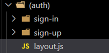

# BaChatBhai

- Using NextJS as the main tool of building.
- Using Shadcn components for prebuilded components.
- Using Luicide icons to add the icons in the web app.
- USing Clerk for the authentication.

---
- Using React Spinners on dashboard to show loading spinner
```bash
npm i react-spinners
```
And here is the code to do this-
```bash
# Dashboard Section --start
<Suspense fallback={<BarLoader className='mt-4' width={"100%"} color='#9333ea' />}>
<DashboardPage />
</Suspense>
```

---
- Using Lenis for smooth scrolling as a client component and adding it in the layout.
- Using Motion Progress Bar for top of the page as a client component and adding it in the layout.
- Using ScrollRevealSection for the scroll animation of the section, we have to add them at the start and end of the sections.
---

- Using Actions folder to write the backend api code instead of api folder inside the app directory.
(don't forget to add "use server" on the top of the file)

---
- Using Optional App Routes to make own route for clerk authentication sign-in and sign-up.
- Using personalized routes here in (main) folder it will used to organize the routes only.
- using layout.js inside this  just to give layout to both of the routes, it makes simple to give same design to both components/routes.

---

- Using 'date-fns' to handle date easily in nextjs project.
```bash
npm i date-fns
```
---
- Using Postgress SQL as a database.
- Using Prisma (like mongoose for no sql) to create the schema and all.
- Using Supabase instead of firebase for sql database to create and view of the table.
- Using ArcJet for extra security in the web app.
- USing Inngest Cloud will be used to send the mails without creating any structure for backend and all.
---

# Working with Postgress SQL Using Prisma and Supabase

- Run this command to initialize the prisma
```bash
 npm i -D prisma
```

- Now this command to create the prisma/schema.prisma
```bash
npx prisma init
```

- Then after adding the prisma.js (creating table)
```bash
npx prisma migrate dev --name create_models
```

---

# Liveblocks AI Chat Integration

- Added Liveblocks AI chat that can answer questions about user's financial data
- The AI can access:
  - User accounts and balances
  - Transaction history
  - Spending analysis by category
  - Financial summaries

## Setup Instructions:

1. Sign up at [Liveblocks](https://liveblocks.io)
2. Create a new project and get your API keys
3. Add the following to your `.env.local`:
   ```
   NEXT_PUBLIC_LIVEBLOCKS_PUBLIC_KEY=your_public_key
   LIVEBLOCKS_SECRET_KEY=your_secret_key
   NEXT_PUBLIC_LIVEBLOCKS_COPILOT_ID=your_copilot_id
   ```
4. The AI chat will appear as a floating button in the bottom right corner

## AI Capabilities:
- "Show me my accounts" - Lists all accounts with balances
- "What are my recent transactions?" - Shows latest transactions
- "Analyze my spending" - Provides spending breakdown
- "Show transactions for [category]" - Filters by category
- "What's my financial summary?" - Comprehensive overview